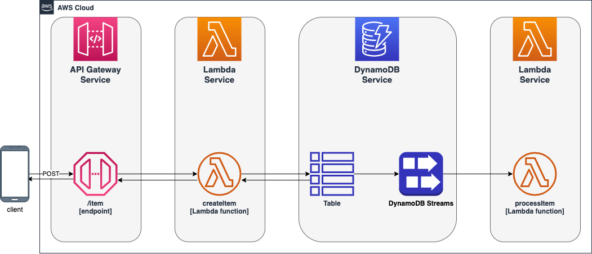

# serverless-hexagonal-template
Highly opinionated project template for [Serverless Framework](https://www.serverless.com/) that applies **hexagonal architecture** principles to the serverless world. Crafted with easy testing in mind.

# Quick start

This is a *template* from which you can create your own project by executing following command:
```
sls create --template-url https://github.com/serverlesspolska/serverless-hexagonal-template --name your-project-name
```

Next install dependencies:
```
cd your-project-name
npm i
```
and deploy to `dev` stage in default region:
```
sls deploy
```
# High-level architecture
This template implements following architecture.

# Why use this template?
This template project was created with two goals in mind: ***streamlined developer's flow*** and ***easy testing***, because, sadly, both are not common in serverless development yet. 

## Standardized structure
The project structure has been worked out as a result of years of development in Lambda environment using Serverless Framework. It also takes from the collective experience of the community (to whom I am grateful) embodied in books, talks, videos and articles.

This template aims to deliver *common structure* that would speed up development by providing sensible defaults for boilerplate configurations. It defines *where what* should be placed (i.e. source code in `src/` folder, tests in `__tests__` etc.) so you don't need to waste time on thinking about it every time you start new project and creates common language for your team members. Thus, decreasing *cognitive overload* when switching between projects started from this template.

## Hexagonal architecture
Design of the code has been planned with hexagonal architecture in mind. It allows better separation of concerns and makes it easier to write code that follows single responsibility principle. Those are crucial characteristics that create architectures which are easy to maintain, extend and test.

## Easy testing
Tests are written using `jest` framework and are divided into three separate groups:
* unit
* integration
* end to end (e2e)

### Unit tests
Those tests are executed locally (on developers computer or CI/CD server) and don't require access to any resources in the AWS cloud or on the Internet.

Unit tests are ideal to test your *business logic*. You may also decide to test your *services* (located at `src/common/services`). Both are really easy to do when using **hexagonal architecture**.

Please **don't** mock whole AWS cloud in order to test everything locally. This is wrong path. Just don't do that. 😉

```
npm run test
```

### Integration tests

Integration tests focus on pieces of your code (in OOP I'd say *classes*), that realize particular *low* & *mid* level actions. For example your Lambda function may read from DynamoDB, so you would write a *service* and *adapter* modules (classes) that would implement this functionality. Integration test would be executed against **real** DynamoDB table provisioned during deployment of that project. However the code will be running locally (on you computer or CI/CD server).

Those tests require resources in the cloud. In order to execute them you first need to *deploy* this project to AWS. 
```
sls deploy
npm run integration
```
Those commands deploy project to the cloud on `dev` stage and execute integration tests.

The `npm run integration` command executes underneath the `serverless-export-env` plugin that exports environment variables set for each Lambda function in the cloud. Results of that command are saved locally to the `.awsenv` file. This file is later injected into `jest` context during tests.

There is also a *shortcut* command that executes tests but doesn't execute `serverless-export-env` plugin. It requires the `.awsenv` file to be already present. Since environment variables don't change that often this can save you time.
```
npm run int
```

### End to end tests (e2e)
End to end tests focus on whole use cases (from beginning to the end) or larger fragments of those. Usually those tests take longer than integration tests. 

An example of such test would be `POST` request send to API Gateway endpoint and check if new item was created in DynamoDB database.

```
npm run e2e
```

#### GUI / acceptance tests
End to end tests are not a substitution to GUI or acceptance tests. For those other solutions (such as AWS CloudWatch Synthetics) are needed.

## Deployment

Deployment to `dev` stage.
```
sls deploy
```
Deployment to a specific stage
```
sls deploy -s <stage> # stage = dev | test | prod
```

# What's included?

Serverless Framework plugins:
- serverless-iam-roles-per-function - to manage individual IAM roles for each function
- serverless-export-env - to export Lambda functions environment variables in `.awsenv` file


Node.js development libraries:

* AWS SDK
* Eslint with modified airbnb-base see `.eslintrc.yml`
* Jest
* dotenv 

